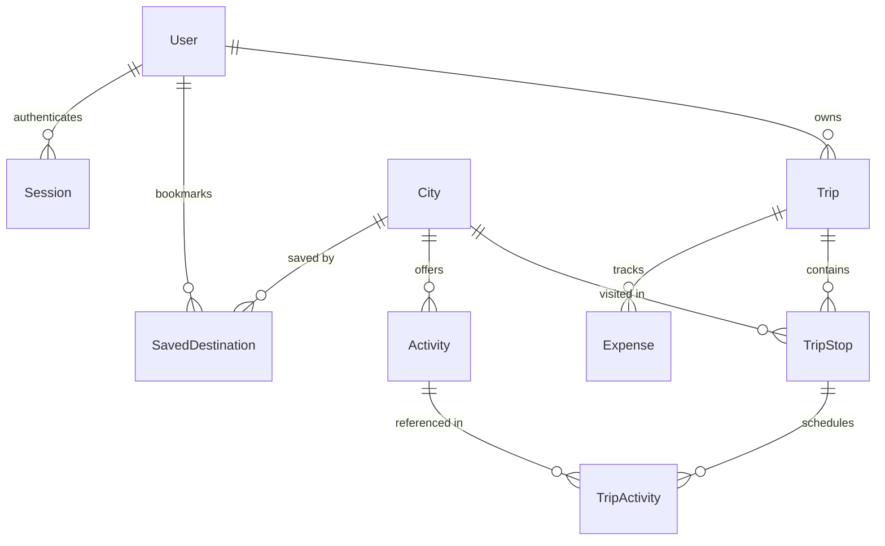

# GlobeTrotter Architecture Documentation
## Technical Lead & Backend Architect: Yaksh

---

## 1. Overview & Architectural Principles

GlobeTrotter is designed using a layered, domain-driven architecture on Next.js 14+ (App Router) and Prisma ORM. It enforces strict separation of concerns:

1. **Route Handlers (`/src/app/api/*`)**: Thin HTTP endpoints responsible for parsing HTTP input, invoking Zod validation schemas, delegating business logic to domain services, and returning standardized API responses.
2. **Domain Services (`/src/services/*`)**: Reusable, pure TypeScript service classes containing all core business logic, transactional invariants, mathematical budget aggregations, and permission validations.
3. **Database Layer (`/prisma/*` & `/src/lib/prisma.ts`)**: Relational schema powered by Prisma ORM, configured for SQLite local development and PostgreSQL / Supabase in production with full foreign key constraints and cascade deletion.
4. **Security & Authentication Layer (`/src/lib/auth.ts`)**: JWT session management, bcrypt salt hashing, and dual-mode token extraction (HTTP Authorization Bearer headers and HTTP-only cookies).
5. **Shared Types (`/src/types/index.ts`)**: Authoritative TypeScript types exported for frontend developers (Dhanvi, Deep, Dhruv).

---

## 2. Relational Database Schema



### Models & Invariants
- **User (`users`)**: Primary identity with role-based access (`USER`, `ADMIN`), currency preference, and bio.
- **Trip (`trips`)**: Root entity for itineraries. Validates `startDate <= endDate`. Supports `PRIVATE`, `PUBLIC`, `UNLISTED` visibilities and unique public `shareSlug`.
- **TripStop (`trip_stops`)**: Multi-city stopping point within a trip. Invariant: `trip.startDate <= arrivalDate <= departureDate <= trip.endDate`. Holds transport and accommodation details.
- **City (`cities`)**: Global destination catalog with coordinates, cost indices (`BUDGET`, `MODERATE`, `LUXURY`), popularity scores, and curated activities.
- **Activity (`activities`)**: Master catalog of curated experiences with duration, rating, estimated cost, and category.
- **TripActivity (`trip_activities`)**: Scheduled activity on a specific day within a stop. Invariant: `scheduledDate` must be between the parent stop's arrival and departure dates.
- **Expense (`expenses`)**: Custom categorized expenditure (`TRANSPORT`, `STAY`, `ACTIVITIES`, `MEALS`, `MISCELLANEOUS`).
- **SavedDestination (`saved_destinations`)**: User destination wishlists with `@@unique([userId, cityId])` to prevent duplicate bookmarks.

---

## 3. Core Business Logic & Engines

### A. Automated Budget Engine (`BudgetService`)
The budget engine automatically aggregates financial data from all sources:
- **Transport**: Sum of `trip_stops.transportCost` + `expenses(TRANSPORT)`
- **Stay**: Sum of `trip_stops.accommodationCost` + `expenses(STAY)`
- **Activities**: Sum of `trip_activities.actualCost` (or master activity cost) + `expenses(ACTIVITIES)`
- **Meals**: Sum of `expenses(MEALS)`
- **Miscellaneous**: Sum of `expenses(MISCELLANEOUS)`
- **Total Estimated Cost**: Sum of all category costs.
- **Average Daily Cost**: `totalEstimatedCost / max(1, duration in days)`
- **Overbudget Calculation**:
  ```ts
  isOverBudget = totalBudget > 0 && totalEstimatedCost > totalBudget;
  overBudgetAmount = isOverBudget ? totalEstimatedCost - totalBudget : 0;
  ```

### B. Timeline & Calendar Engine (`ItineraryService.getTimeline`)
- Computes day-by-day continuous intervals from `trip.startDate` to `trip.endDate`.
- Automatically assigns active cities, daily accommodation allocations, arrival transport costs, and scheduled activities sorted by time.

### C. Public Sharing & Safe Trip Cloning (`PublicTripService`)
- **Sharing**: Toggling visibility to `PUBLIC` generates a secure cryptographic slug (`trip-xxxxxx`).
- **Sanitization**: Public views filter out creator email, password hashes, and private account IDs.
- **Cloning**: Clones the complete graph (trip, stops, activities, expenses) into the new user's account inside a single atomic Prisma transaction (`prisma.$transaction`).

### D. AI & Personalization Layer (`AiService`)
- Clean abstraction supporting external LLMs (`LLM_API_KEY`, `LLM_MODEL`) with Zod-validated structured output.
- Deterministic explainable fallback engine if LLM is offline or unconfigured, utilizing user trip history, saved destinations, and destination cost indices.

---

## 4. Security & Error Handling

### Error Hierarchy
All exceptions inherit from `AppError` and are mapped to standard HTTP status codes:
- `ValidationError` (400) -> `VALIDATION_ERROR` (with Zod field details)
- `UnauthorizedError` (401) -> `UNAUTHENTICATED`
- `ForbiddenError` (403) -> `FORBIDDEN`
- `NotFoundError` (404) -> `NOT_FOUND`
- `ConflictError` (409) -> `CONFLICT`
- Internal errors (500) -> `INTERNAL_ERROR` (sanitized without leaking stack traces)

---

## 5. Team Integration Boundaries

- **Yaksh (Backend)**: Database, Prisma, Auth, Route Handlers, Services, Shared Types, Seed Data, Tests.
- **Dhanvi (Frontend - Dashboard, Trips, Profile)**: Consumes `/api/auth/*`, `/api/profile`, `/api/trips`, `/api/dashboard/stats`.
- **Deep (Frontend - Discovery & Search)**: Consumes `/api/cities`, `/api/cities/[id]`, `/api/activities`, `/api/saved-destinations`.
- **Dhruv (Frontend - Itinerary, Timeline, Budget, Sharing)**: Consumes `/api/trips/[id]/stops`, `/api/trips/[id]/activities`, `/api/trips/[id]/budget`, `/api/trips/[id]/timeline`, `/api/trips/[id]/share`, `/api/trips/share/[slug]`, `/api/trips/[id]/clone`.
